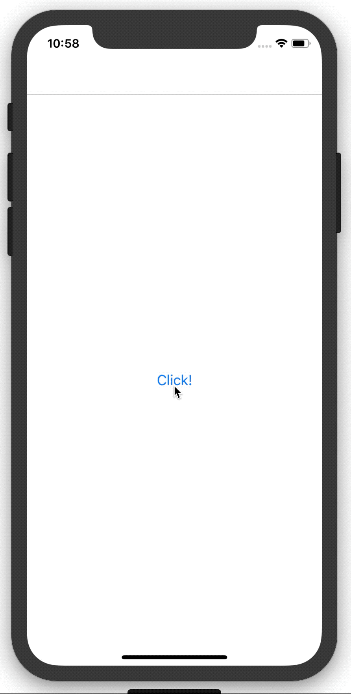

# react-navigation-redux-boilerplate


## Installation

1. `$ git clone https://github.com/TaeJoongYoon/react-navigation-redux-boilerplate.git`
2. `$ npm install`
3. `$ react-native run-ios` or `$ react-native run-android`


## Structure

```
/src
  --/navigators
     AppNavigator.js
     RootNavigator.js
     TabNavigator.js
  --/reducers
     --/nav
        actionTypes.js
        reducer.js
     index.js
  --/screens
     FirstScreen.js
     Tab1Screen.js
     Tab2Screen.js
     DetailScreen.js
 App.js
 index.js
```


## View


